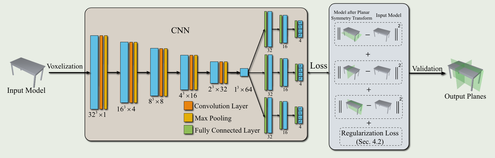

## PRS-Net: Planar Reflective Symmetry Detection Net for 3D Models

PRS-Net模型复现

[原文链接](https://ieeexplore.ieee.org/document/9127500/)

### 简介

这篇文章提出了一种基于CNN的平面反射对称性检测的模型PRS-Net，其主要有以下贡献：

- PRS-Net是首个使用了无监督的深度学习方法解决平面反射对称性检测问题的模型，比现有最好模型的计算速度快了上百倍。
- 提出了两种损失函数，即对称距离损失（使模型可以使用无监督的方法训练）和正则化损失（避免产生重复的平面）。

### 网络结构



PRS-Net是一个基于CNN的深度神经网络，它的输入是一个转换为32 * 32 * 32的体素的3D对象模型，经过5层CNN得到对象的对称信息嵌入。

接着，将嵌入输入到3层的全连接神经网络中，用于提取模型可能存在的对称平面或旋转对称轴。

其中，每层CNN后进行池化和激活操作，每层全连接神经网络后也需要进行激活。

模型的输出是六个四维向量，分别表示潜在的三个对称平面和三个旋转轴。

其中，平面使用一般式即Ax+By+Cz+D=0进行表示，旋转轴使用四元数进行表示。

### 损失函数

这篇文章定义了两种损失函数，分别为对称距离损失函数和正则化损失函数。

- 对称距离损失函数的目的是评估输入的三维对象模型是否关于输出的潜在对称平面（旋转轴）对称。
它的具体做法是：对输入模型进行N次随机采样，得到N个模型上的点。
接着对每个点根据输出的潜在对称平面（旋转轴）进行对称变换。
由此得到了经过对称变换后的点集，再和原模型进行对比，计算变换后的点集与模型之间的偏差。
其中偏差具体计算方法如下：
  - 首先预处理出每个体素中心到模型表面每个点的距离最小的那个点。
  - 对于对称变换后的每个点，计算出这个点本身到距离其最近的体素中心预处理出的模型点的距离，作为这个点的偏差。

  则该损失就定义为每个采样点分别关于三个对称平面和三个旋转轴计算出的偏差之和。


- 正则化损失函数的目的是防止模型输出几乎相同的对称平面（或旋转轴）。
由于每个对称平面（旋转轴）是单独计算的，可能会存在两个或更多对称平面几乎重合，导致某些对称平面未被预测出来。
添加正则化损失后，它将限制模型尽可能输出不同的对称平面或旋转轴，其具体做法如下：
  - 定义一个3 * 3的矩阵，其中每行均为一个对称平面经过归一化后的法向量。
  - 将该矩阵乘以其本身的转制，接着减去单位向量。
  - 此时，若三个对称平面两两正交，则此矩阵为0矩阵。
  
  对于旋转轴，也是相同的操作方法。此时，定义损失为该矩阵的Frobenius范数。

总体损失函数定义为L1+wL2，其中w用于平衡两种损失的重要程度。

通过以上损失函数，实现了模型的无监督学习，同时避免了模型产生相同的对称平面。

### 模型实现

实现使用了ShapeNetCore.v2数据集。

通过open3d提取.obj模型转换为散点，预处理出每个网格中心到模型距离最小的点，并生成体素模型。
最终将所有的模型保存为.npy文件，由于数据集较大，每2048个模型保存为一个.npy文件。

模型经过约300个epoch后收敛

#### 依赖

- 代码中使用了open3d, torch, numpy, matplotlib

#### 训练

将ShapeNetCore.v2数据集解压缩，移动至data/ShapeNet下。
```shell
unzip ShapeNetCorev2.zip
cd PRS-Net
mv -R ../ShapeNetCore.v2 data/ShapeNet
```

运行data/data_preprocess.py进行数据预处理
```shell
python data/data_preprocess.py
```

开始训练
```shell
python train.py
```

训练结束后，结果样例图片会存储在result目录下